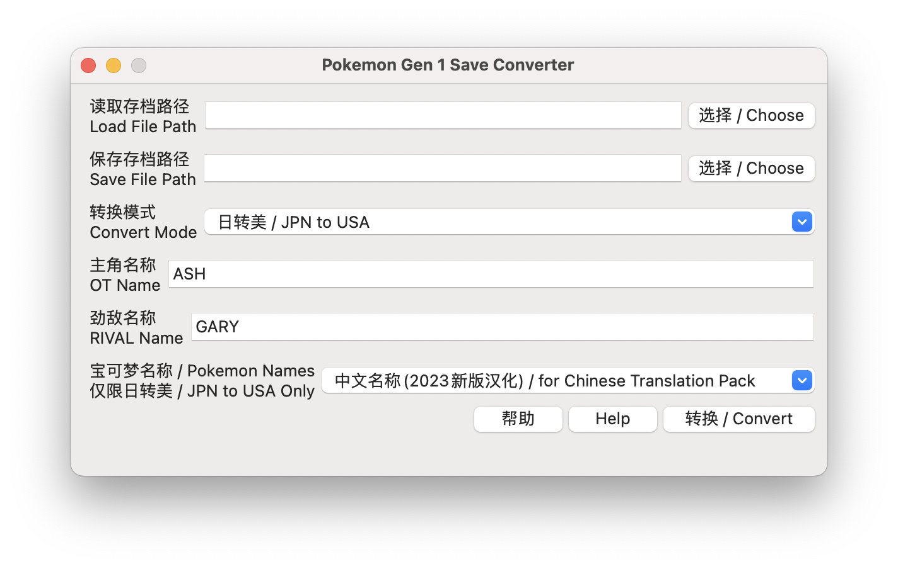
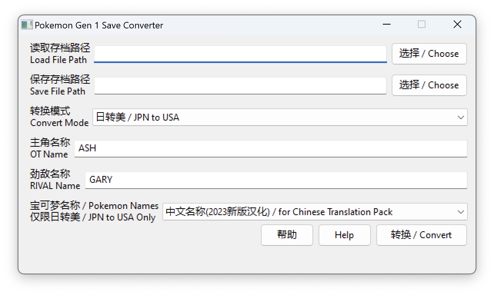

# 宝可梦第一世代 日版/国际版 存档转换器 V2.0

## 概览
由于宝可梦第一世代「红·绿·蓝·黄」分为日版和国际版，两个版本相互之间存档联机都不通用，故编写此工具。方便大家把日版和基于日版汉化的存档转到美版和基于美版的汉化。反过来转换也没有问题。

## 使用方法
- 如果使用 .py 脚本，需要安装 python3 + wxPython环境。另有预编译的 x86_64 Windows 版，和 x86_64 + arm64 Mac 版独立应用。
- 使用 python3 打开 convert.py。

## 无法迁移的数据
- 宝可梦昵称无法迁移，将按照宝可梦种类还原成默认名字。
- 初训家/玩家名称/劲敌名称无法迁移，这些内容迁移时会被重置。
- 名人堂记录数据将不会被迁移。
- 美版存档转日版存档时，当前盒子以外，剩余 11 个盒子的宝可梦若超过 210 只 （最大 220 只），将只迁移前面的 210 只。

除此之外，其他数据都会迁移。若迁移后遇到死机问题，请换一个地点再次尝试。